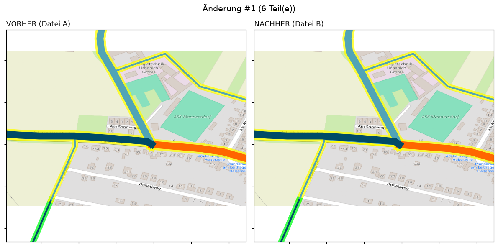

* Radlkarte Compare Python Skript

Das Python Skript hilft bei der Visualisierung von Unterschieden zwischen zwei Geojson-Dateien. Es ist genau auf die Verwendung im Projekt radlkarte.at angepasst und wurde großteils via KI-Modell qwen 3.8 entwickelt. Es handelt sich um ein Python 3 Skript. Es wurde manuell mithilfe von Testdaten mit Python 3.14 überprüft. 

** Funktionsweise

Das Skript überprüft mithilfe der Symmetrischen Differenzberechnung die Unterschiede zwischen den beiden Dateien. Zusätzlich wird ein Clustering durchgeführt, um Änderungen die nahe beieinander liegen zusammenzufassen. So wird auch die Anzahl der ausgegebenen Ergebnisdateien reduziert. Als Ergebnis werden für jeden gefundenen Cluster eine PNG-Datei erstellt und in einem Ergebnis-Ordner abgelegt. Die PNG-Datei zeigt einen Vorher/Nachher Vergleich an, indem die gefundene Stelle in zwei Plots nebeneinander dargestellt werden. Die Geometrien werden nach dem Styling von radlkarte.at dargestellt, um so die Unterschiede besser darstellen zu können. Des Weiteren werden OpenStreetMap Tile als Hintergrund verwendet, um so die visuelle Verortung zu erleichtern.

#+CAPTION: Beispiel Ausgabe

** Installation

Das Python-Skript selbst muss heruntergeladen werden. Entweder das Repo klonen oder aus github herunterladen.

Das Skript benötigt folgende Pakete:

#+begin_src bash
pip install geopandas shapely matplotlib pandas pillow pyogrio
#+end_src

** Ausführung

#+begin_src python
python3 radlkarte_compare.py datei_alt.geojson datei_neu.geojson [ausgabe ordner] [max_renders] [cluster_buffer_deg]
#+end_src

*** Parameter

- datei_alt.geojson
- datei_neu.geojson
- ausgabe_ordner        optional
- max_renders           optional
- cluster_buffer_deg    optional

datei_alt.geojson
Die Datei, die die Situation vor der Anpassung enthält.

datei_neu.geojson
Die Datei, die die Situation nach der Anpassung enthält.

max_renders
ist ein optionaler Parameter, der begrenzt, wie viele Vergleichsbilder maximal erzeugt werden.

max_renders = 0
→ kein Limit, es werden alle gefundenen Cluster/Bilder erzeugt.

max_renders = 10
→ es werden nur die ersten 10 Cluster als Bilder gerendert.

CLUSTER_BUFFER_DEG
Damit stellst du ein, wie nah zwei Änderungsbereiche sein dürfen, damit sie zu einem Cluster zusammengefasst werden.

- 0.001 ≈ ca. 100 m
- 0.003 ≈ ca. 300 m
- 0.005 ≈ ca. 500 m
- 0.010 ≈ ca. 1 km

Standardmäßig wird der Wert 0.005 verwendet.

